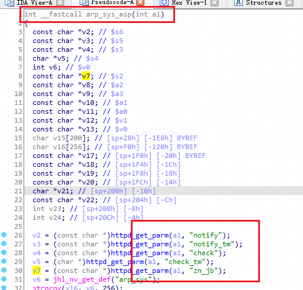

## Dlink DI-8003: 16.07.16A1 stackoverflow

There is a overflow vulnerability in DI-8003: 16.07.16A1. In the arp_sys_asp function, the notify parameter and some other parameters obtained by http will cause buffer overflow.

affected executable: jhttpd,, affected functions: arp_sys_asp

### welcome page of DI_8003

### arp_sys_asp function

