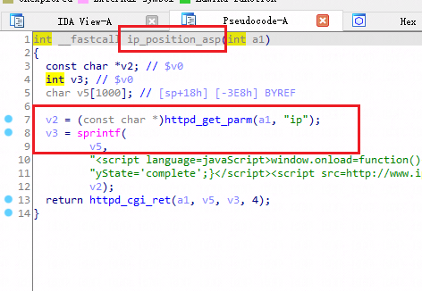
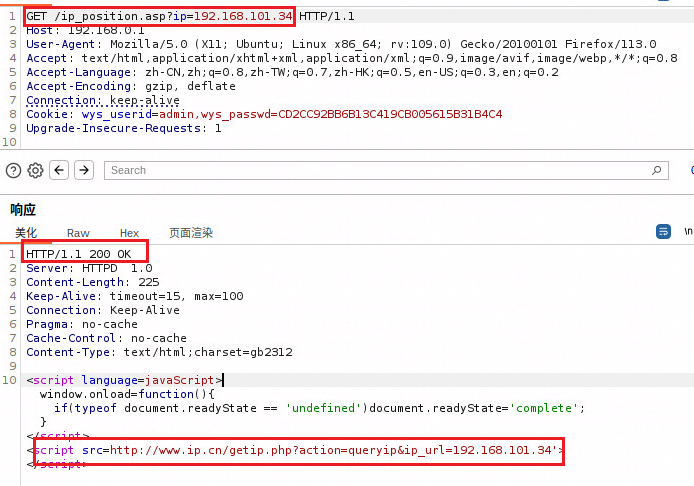
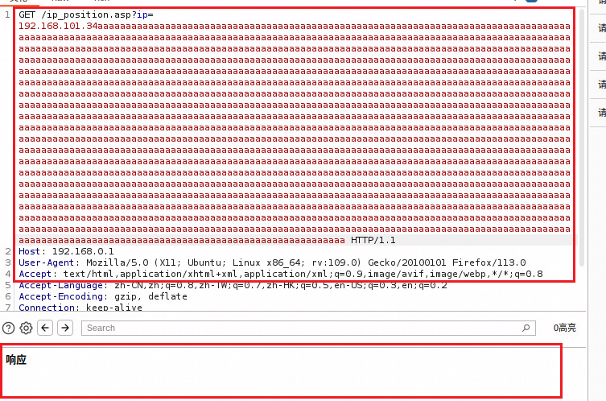
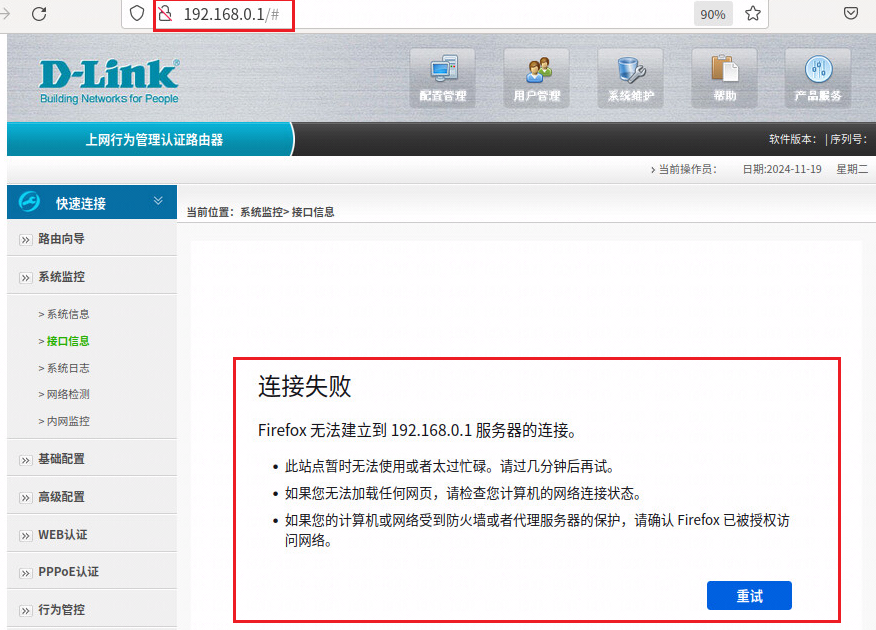

Dlink DI-8003: 16.07.16A1
There is a overflow vulnerability in DI-8003: 16.07.16A1. In the ip_position_asp function, the parameters ip by http will cause buffer overflow.
affected executable: jhttpd,, affected functions: ip_position_asp

