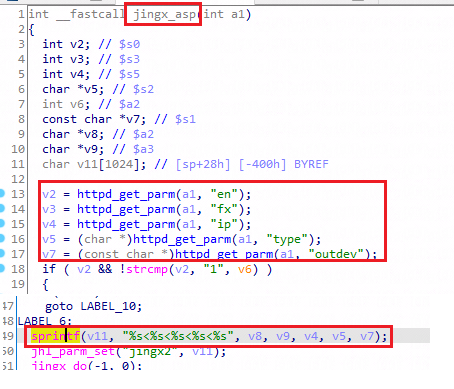

## Dlink DI-8003: 16.07.16A1

There is a overflow vulnerability in DI-8003: 16.07.16A1. In the jingx_asp function, the parameter fx by http will cause buffer overflow.
affected executable: jhttpd,, affected functions: jingx_asp

jingx_asp function

check the vuln

deny of service

