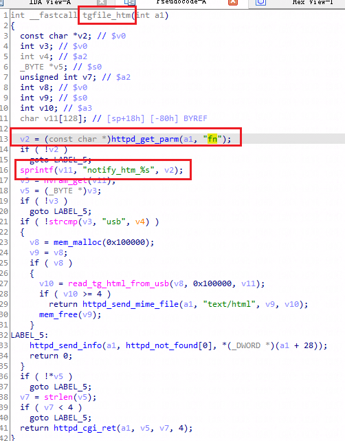
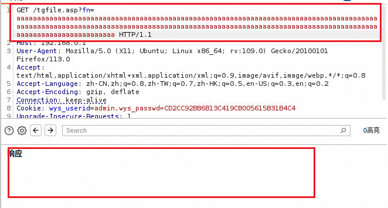
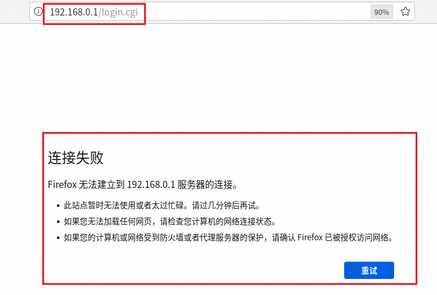

Dlink DI-8003: 16.07.16A1

There is a overflow vulnerability in DI-8003: 16.07.16A1. In the tgfile_htm function, the parameters fn by http will cause buffer overflow.
affected executable: jhttpd, affected functions: tgfile_htm

