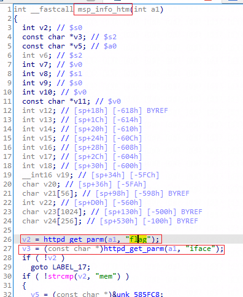
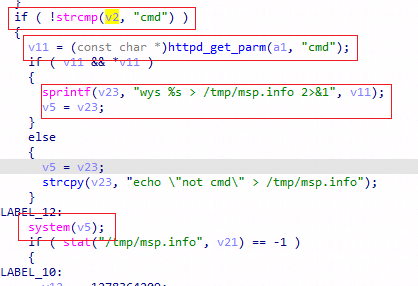
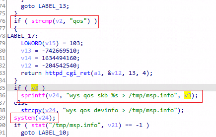
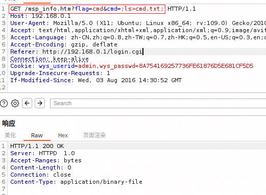
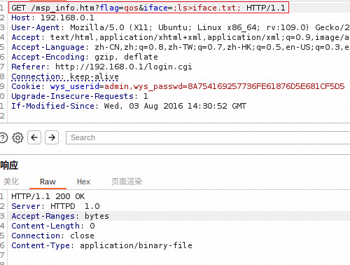
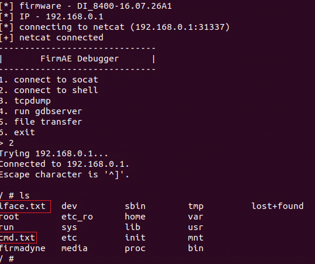

## Dlink DI-8400: 16.07.26A1 RCE

There is a remote command execution vulnerability in DI-8400: 16.07.26A1. 
In the msp_info_htm function, the parameter flag and cmd or iface by http will cause remote command execution.

affected executable: jhttpd, affected functions: msp_info_htm

### msp_info_htm function

### exploit

### check !!!

