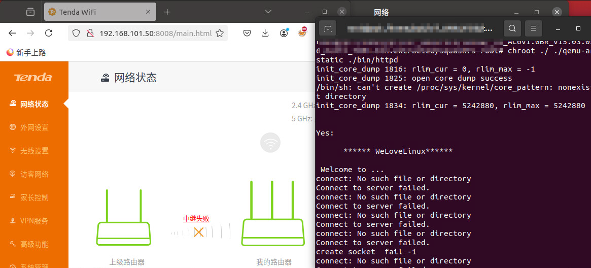
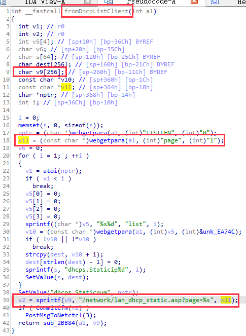
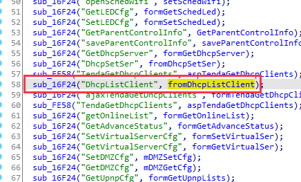
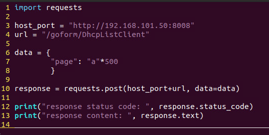
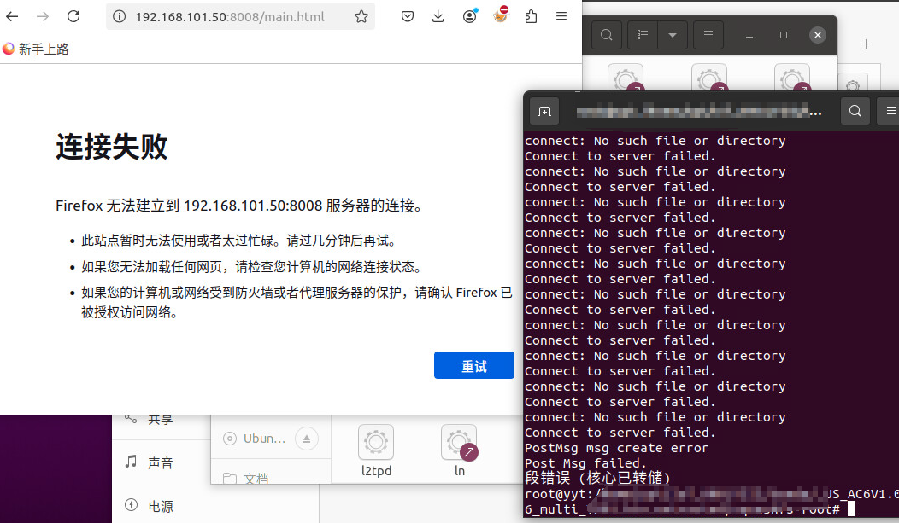

# Tenda AC6 : 15.03.05.16_multi
There is a overflow vulnerability in AC6 : 15.03.05.16_multi. In the fromDhcpListClient function(target url: DhcpListClient), the parameters page by http will cause buffer overflow.

POC

Bingo

