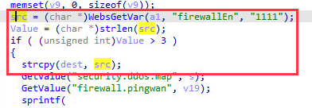
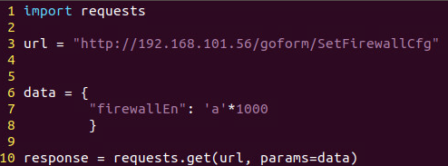
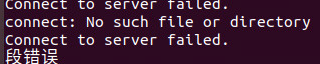

# Tenda AC6 : 15.03.05.16_multi

There is a rce vulnerability in AC6 : 15.03.05.16_multi. In the formSetFirewallCfg function(target url: SetFirewallCfg), the parameters firewallEn by http will cause stack overflow.

