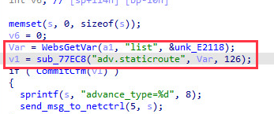
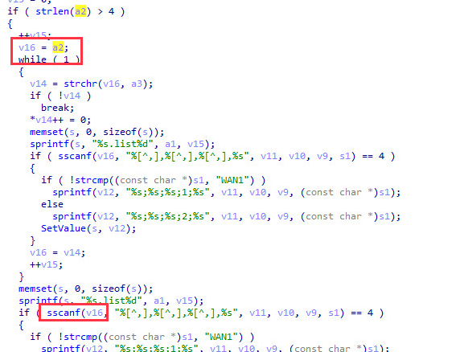
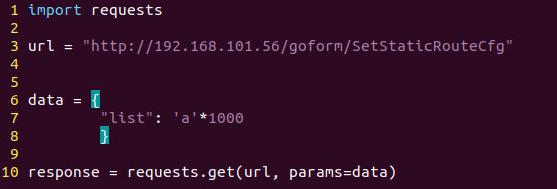
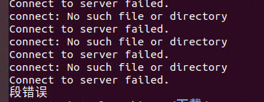

# Tenda AC6 : 15.03.05.16_multi

There is a rce vulnerability in AC6 : 15.03.05.16_multi. In the fromSetRouteStatic function(target url: SetStaticRouteCfg), the parameters list by http will cause stack overflow.

