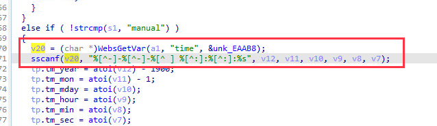
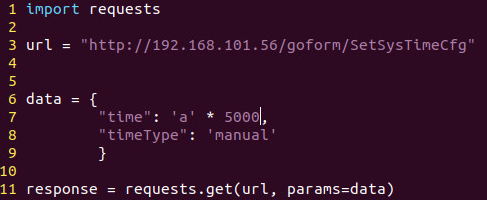
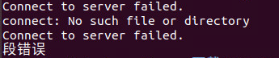

# Tenda AC6 : 15.03.05.16_multi

There is a rce vulnerability in AC6 : 15.03.05.16_multi. In the formSetSysTime function(target url: SetSysTimeCfg), the parameters time by http will cause stack overflow.

