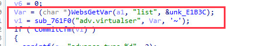
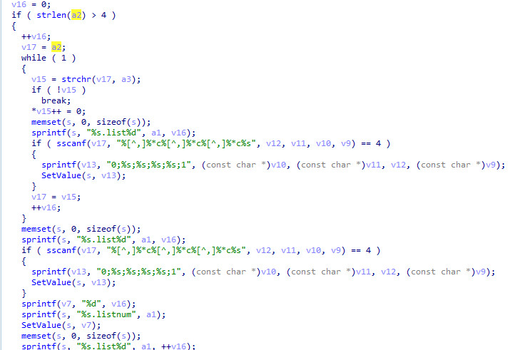
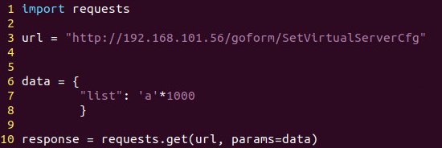
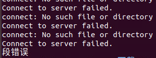

# Tenda AC6 : 15.03.05.16_multi

There is a rce vulnerability in AC6 : 15.03.05.16_multi. In the formSetVirtualSer function(target url: SetVirtualServerCfg), the parameters list by http will cause stack overflow.

