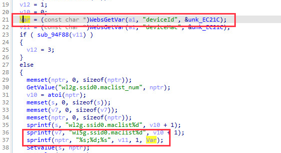
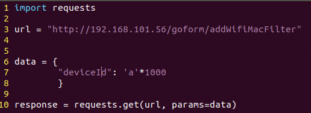
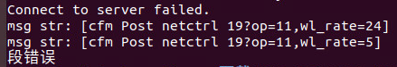

# Tenda AC6 : 15.03.05.16_multi

There is a rce vulnerability in AC6 : 15.03.05.16_multi. In the addWifiMacFilter function(target url: addWifiMacFilter), the parameters deviceId by http will cause stack overflow.

