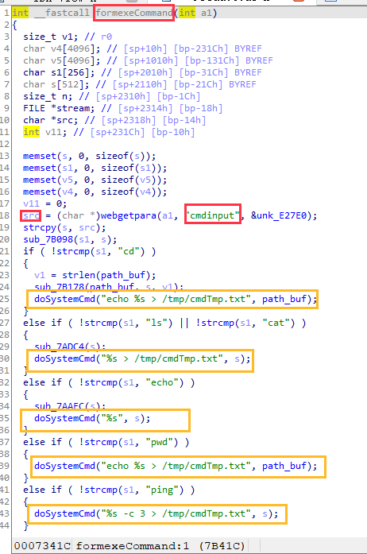
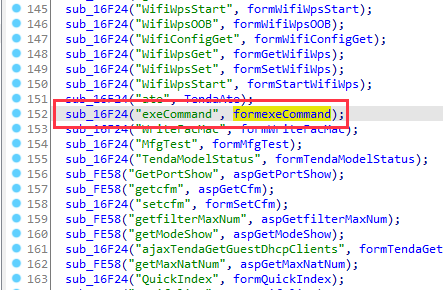
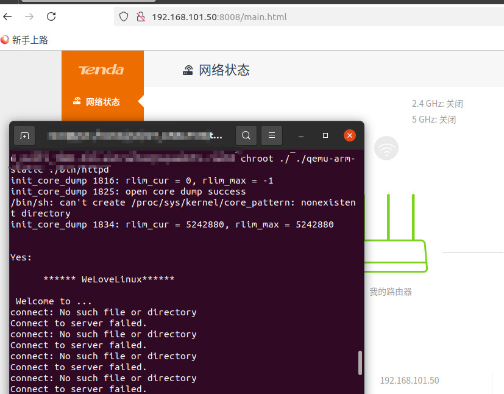
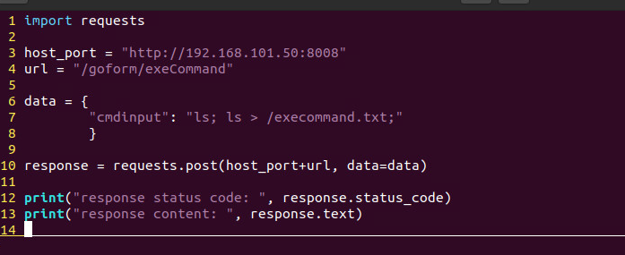
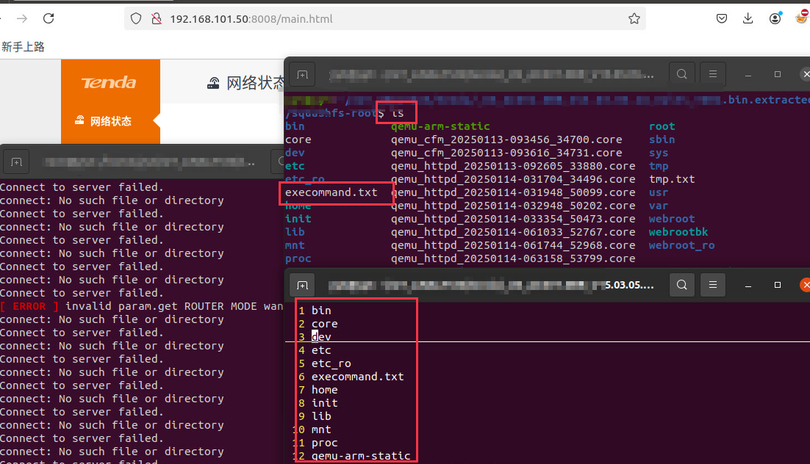

# Tenda AC6 : 15.03.05.16_multi

There is a rce vulnerability in AC6 : 15.03.05.16_multi. In the formexeCommand function(target url: exeCommand), the parameters cmdinput by http will cause remote command execution.

POC

Bingo

