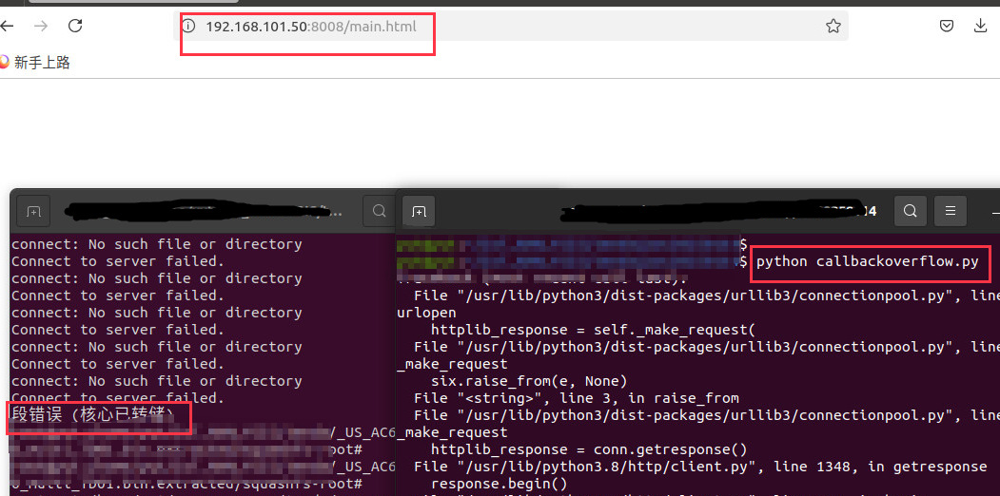

# Tenda AC6 : 15.03.05.16_multi

There is a overflow vulnerability in AC6 : 15.03.05.16_multi. In the sub_452A4 function(target url: getRebootStatus), the parameters callback by http will cause buffer overflow.

POC

Bingo

