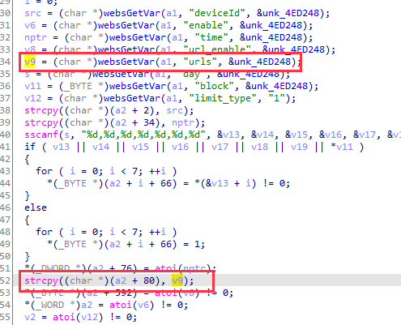
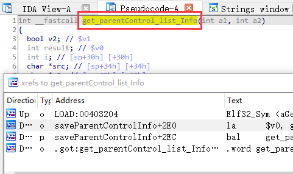
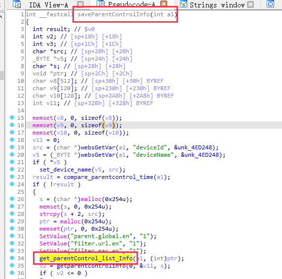
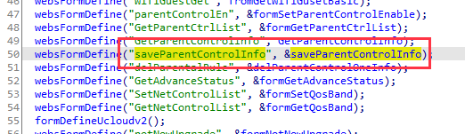
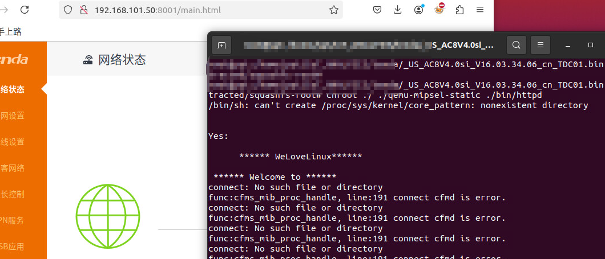
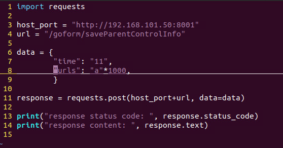
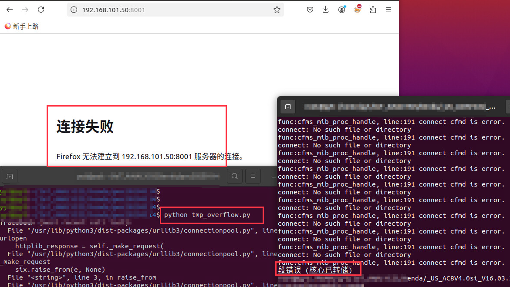

# Tenda AC8 : V16.03.34.06

There is a overflow vulnerability in AC8 : V16.03.34.06. In the get_parentControl_list_Info function(target url: saveParentControlInfo), the parameters urls by http will cause buffer overflow.

POC

Bingo

