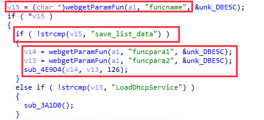
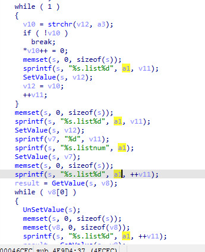
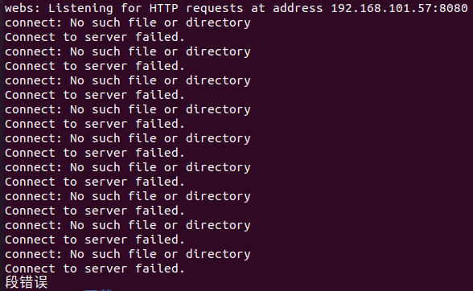
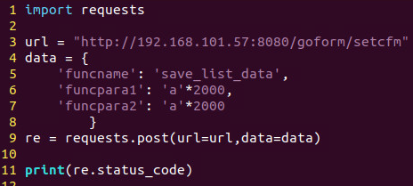

# Tenda AC6 : 15.03.05.16_multi

There is a rce vulnerability in US_AC6V1.0BR_V15.03.05.16_multi_TD01. In the formSetCfm function(uri path: SetCfm), the funcname, funcpara1, funcpara2 parameter obtained by http will cause stack overflow.

affected executable: httpd, affected functions: formSetCfm

