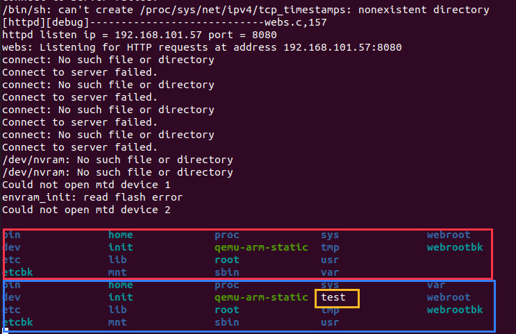

# Tenda AC6 : 15.03.05.16_multi
There is a rce vulnerability in US_AC6V1.0BR_V15.03.05.16_multi_TD01. In the formWriteFacMac function(uri path: WriteFacMac), the mac parameter obtained by http will cause remote command execution.

