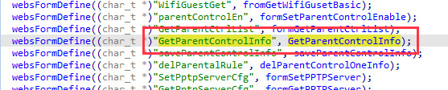

# title
 RX3 V1.0br_V16.03.13.11 overflow vulnerability

firmware: 
[Firmware: RX3 V1.0br_V16.03.13.11]( https://www.tendacn.com/download/detail-3980.html)
 
# info
In the RX3 V1.0br_V16.03.13.11 device, due to the lack of restrictions on some parameters in the GetParentControlInfo function, stack overflow can be caused
# detail

In the GetParentControlInfo function, when the value of the parameter mac obtained by http is mac, the value of the parameter mac obtained by http is concatenated using strcpy. Similarly, stack overflow can be caused without restrictions on the iface parameter.

